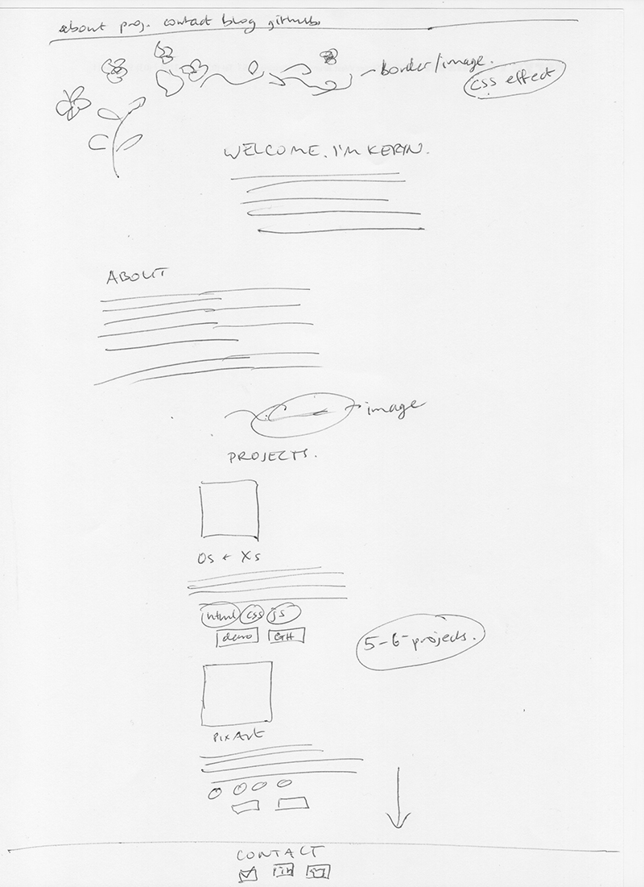

#Portfolio

A one-page portfolio website to show my web dev projects. I wanted the design to be minimal, clean and easy to navigate. I used my original pencil drawing for the front page image.

### Wireframe

<<<<<<< HEAD

=======

>>>>>>> master

### Tech

I built the site from scratch using HTML, CSS, and Javascript/jQuery. The front page image fades in using jQuery and CSS transition, and smooth scrolling between sections is also achieved with jQuery. 

Each project has a link to the code on Github and a demo on Git or Heroku.

